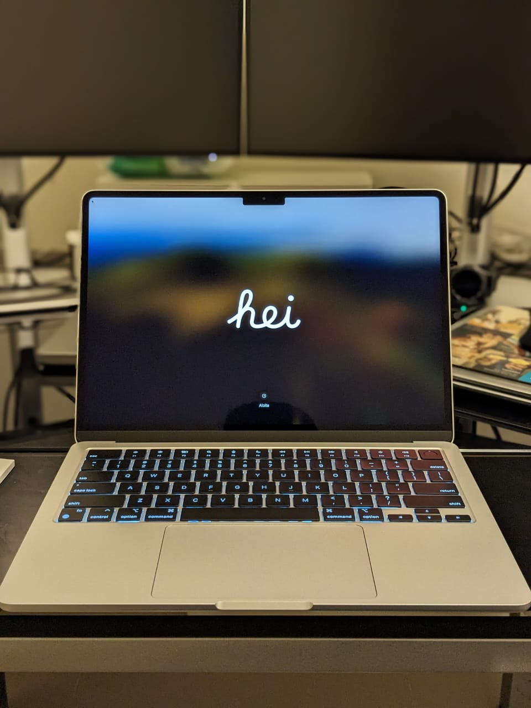
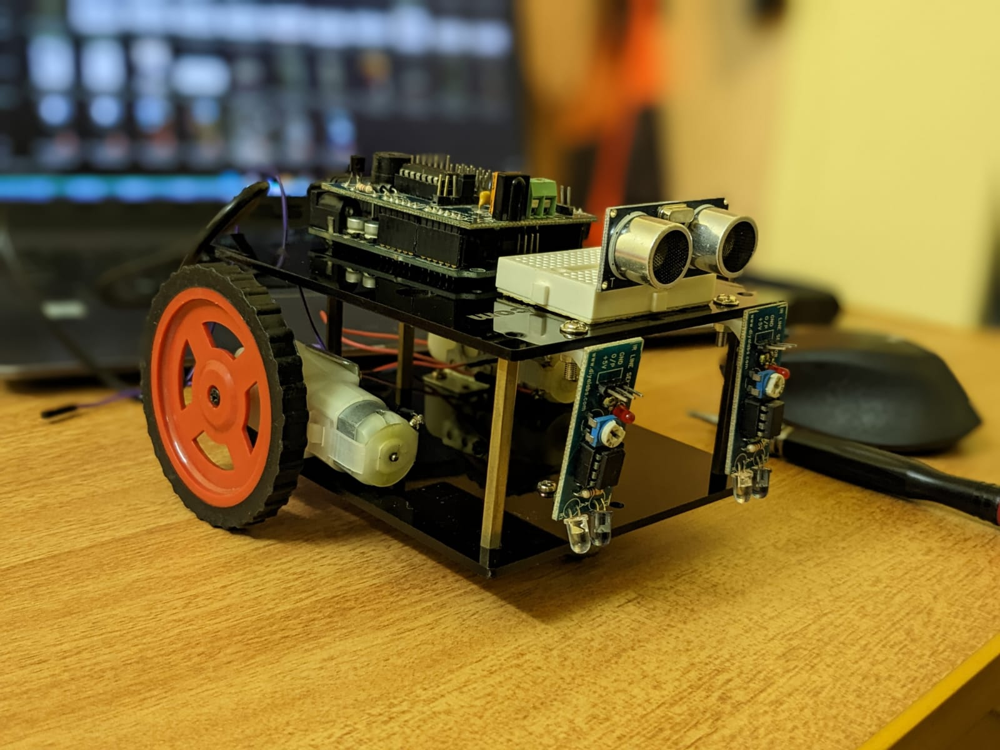
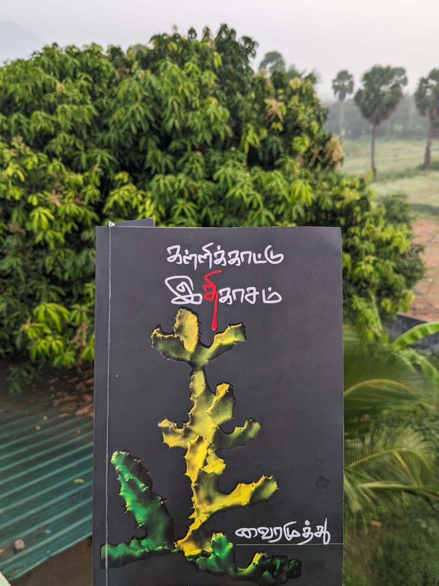
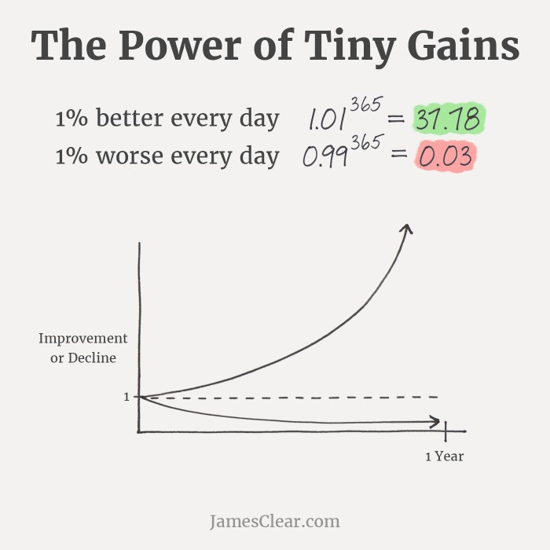
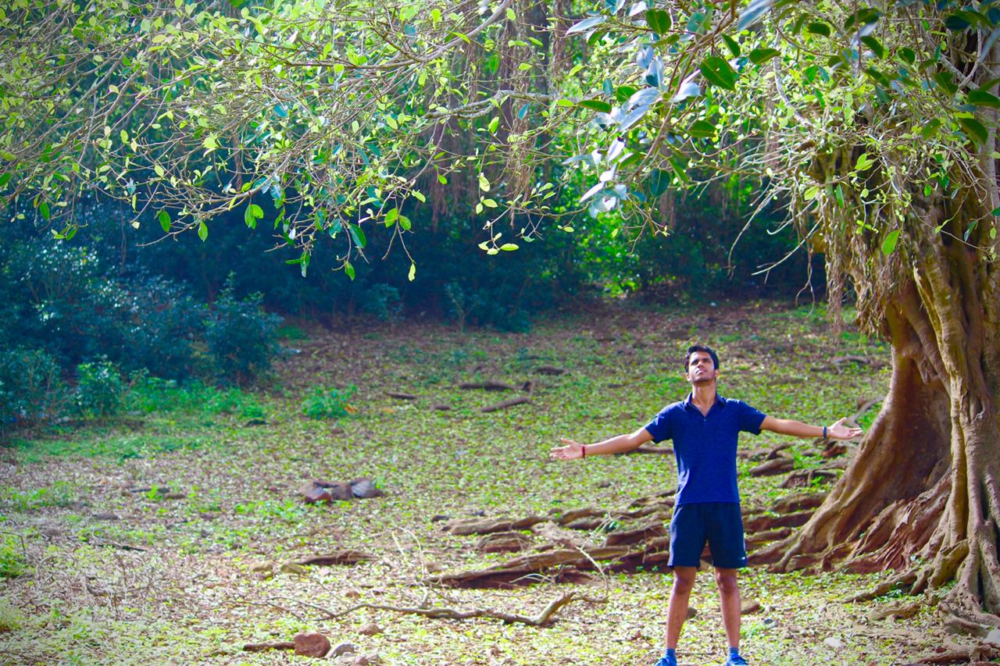

**Welcome to my Digital Garden**

I'm Elam, a Product Solution Engineer at PhonePe. This is my personal living, evolving space where I document what I learn across tech, data, AI, and life.

>[!quote] You can't connect the dots looking forward; you can only connect them looking backwards. So you have to trust that the dots will somehow connect in your future. ― Steve Jobs

## Explore

### [Portfolio](./Portfolio/)

Resume, work experience, AI/LLM projects, and skills. The professional snapshot — built for recruiters and collaborators.

### [Tech](./Tech/)

Projects, courses, and technical learnings. Python, FastAPI, GenAI, machine learning, and backend engineering.

### [Books](./Books/)

Notes and reflections from books I have read — personal finance, self-improvement, and finding purpose.

### [Better Tomorrow](./Better-Tomorrow/)

Interview preparation, career planning, fitness tracking, and conversations that shaped my thinking.

### [Fernweh](./Fernweh/)

Travel stories, places I've explored, lessons from the road, and photos from the journey.

### [Lifestyle](./Lifestyle/)

Personal finance planning and life organization.

